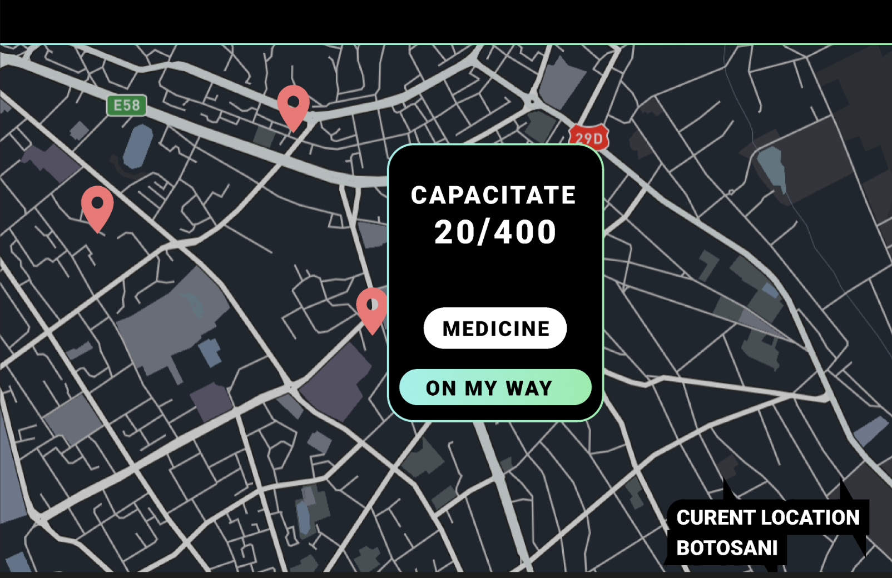

# About

A.T.R.I.S.(Automated Tracking and Response Informational System) is a platform that aims to offer citizens an interactive map with the available bunkers to be used during a natural disaster or war scenario. Even more, we want to offer real-time information about the logistics, supplies, and characteristics of every location (temperature, available medication, etc.).

# Features and history

## Phase 1: PoliHack hackathon - December 2022

Our journey began when we thought about creating a social impact startup during the 2022 edition of [PoliHack](https://polihack.osut.org).

In **48 hours**:

- We planned the basic technical and business aspects of our idea.
- We speed-surveyed over **700** potential users to understand the problem.
- We talked to mentors and other participants, preparing our pitch and technical demo.
- And of course, we had some fun :)

## Little showcase between phases 1 and 2

These photos represent an evolved version of what we were prototyping at that time

## Phase 2: PoliHack Bootcamp - March-April 2023

The **4 talented young innovators** and a **mentor** teamed up to kickstart the **A.T.R.I.S.** social entrepreneurship journey.

Our **goal**? Combatting the lack of information using modern communication channels and techniques such as strategic media vendors partnerships and awareness through games.

How? By leveling up our:

- presentation
- pitch
- pitch deck
- business knowledge
- marketing knowledge
- and last but not least, our **collective** and **personal** brands

We proposed the solutions, came up with the technical aspects, and encouraged others to join us as ambassadors, partners, or both.

## Phase 3: Partnership with Ideafy - April 2023 - Present

To make it easy to promote ourselves and seek assistance from those who want to help, we partnered and listed on [Ideafy](https://www.ideafy.org).

We hope that, from now on, we'll manage to fulfill all of the technical, marketing, and business requirements to launch and promote our product. If you want to help in creating a safer future, drop us a line or reach out to our partners and tell us how you can help.

As we mentioned in our second pitch, **everyone** can be an ambassador of A.T.R.I.S. If you want to contribute, but don't know how or don't have the resources to do so, simply share our mission in your preferred communication channel. Innovation through awareness is one of the greatest things technology has made possible!
